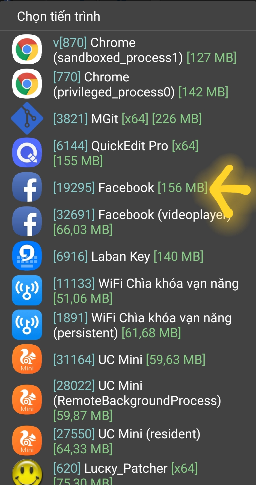
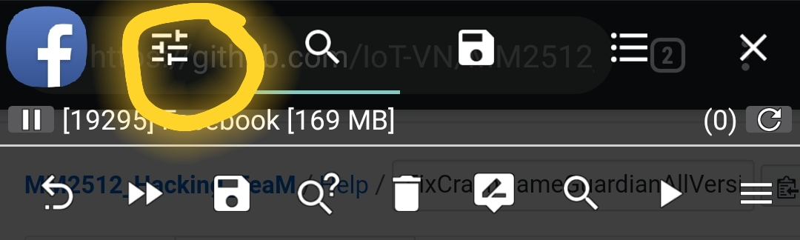
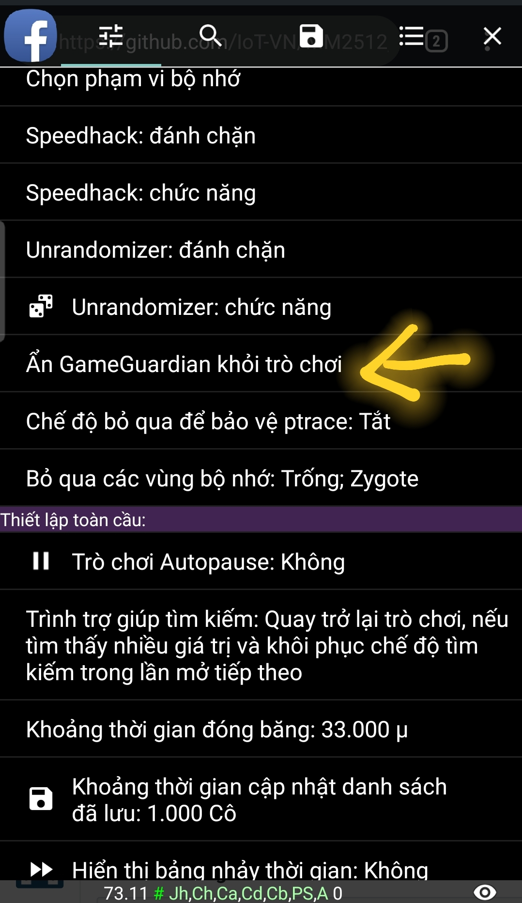
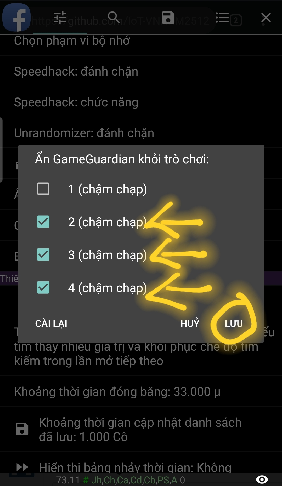
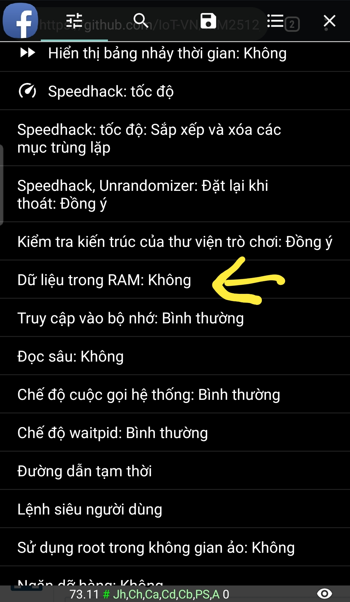

# MM2512 TeaM
## Hướng Dẫn Fix Crash GameGuardian(GG) Khi Chạy Mã
## Tutorial Fix Crash GameGuardian when execute Script

- **Mở GG và chọn app cần hack**
- **Open GG and select process want to hack**
- 
- **Chọn Menu như hình và tìm mục 'Ẩn GG Khỏi Trò Chơi'**
- **Select Menu like image and find Hide GG From Game**
- 
- 
- **Tích chọn mục 2-3-4 như hình và lưu lại**
- **Select 2-3-4 like image and save**
- 
- **Tiếp tục kéo menu xuống tìm 'Dữ Liệu trong ram' và chọn 'Không'**
- **Find 'Data in Ram' and select 'No'**
- 
